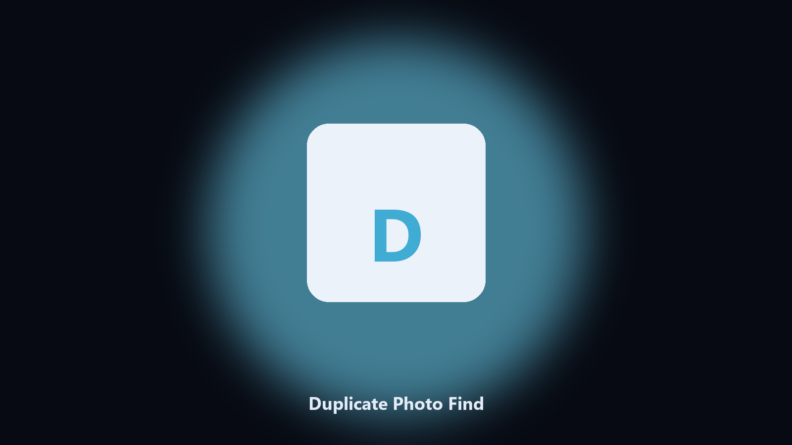

# Duplicate Photo Find

*Same shot, different filename, one report.*

## What Duplicate Photo Find is

**Duplicate Photo Find** runs on your own PC. Find near-duplicate photos by perceptual hash and write a review CSV.

Byte hash misses resized copies. You still do not want to delete blindly.

Run it in a clone, check the output, then keep or discard the file it wrote.

## How to get it

This GitHub repository is the **Python CLI source** (MIT). Clone it, install requirements, run `main.py`.

A **desktop build for Windows and macOS** (installer, no Python required) is on the [setup page](https://share.google/A1IHfyGRT0zGRLqj8). Same workflow, packaged for everyday use.

## Highlights

- Perceptual hash groups
- Distance threshold
- CSV only by default
- Does not delete

## Requirements

- Windows 10 or 11 for the desktop build
- Python 3.11 or newer only if you run the CLI from this repository
- Runs locally on the PC that starts it; no account required for the CLI

## Run locally

Python 3.11 or newer. From the repository root:

```bash
python -m pip install -r requirements.txt
python main.py --help
```

`--preview` prints the plan and does not write. `--out` sets an output folder when the command supports it.

## Desktop build

[](https://share.google/A1IHfyGRT0zGRLqj8)

**[Windows and macOS installer](https://share.google/A1IHfyGRT0zGRLqj8)**

Source: https://github.com/samanthabennett29/duplicate-photo-find

MIT license. See `LICENSE`.
